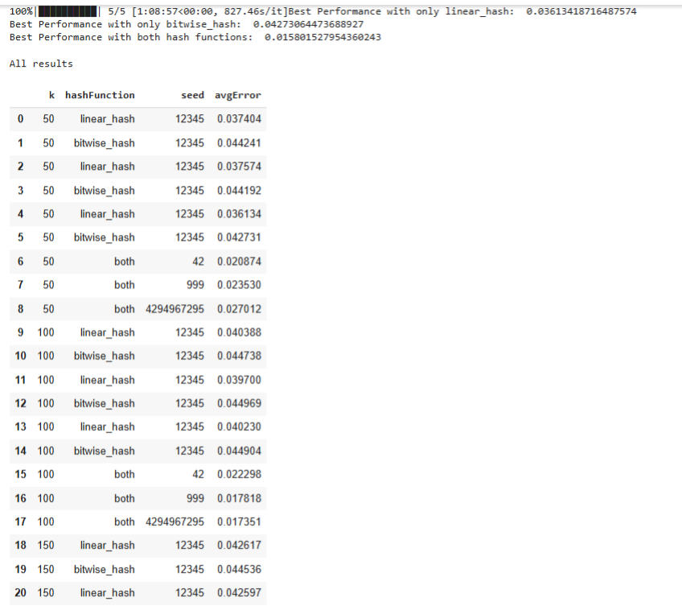
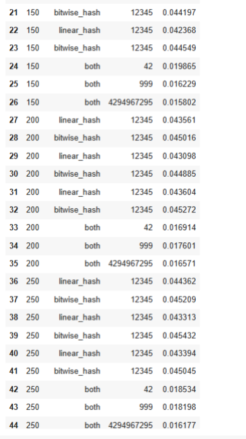
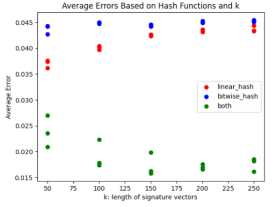
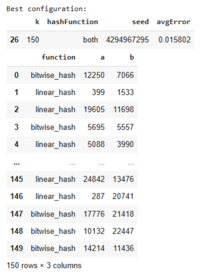
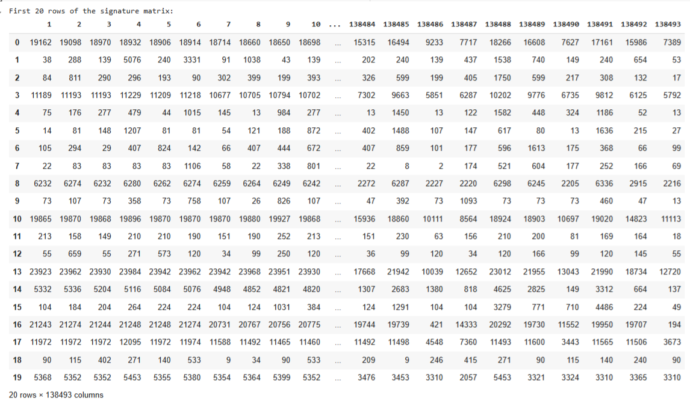
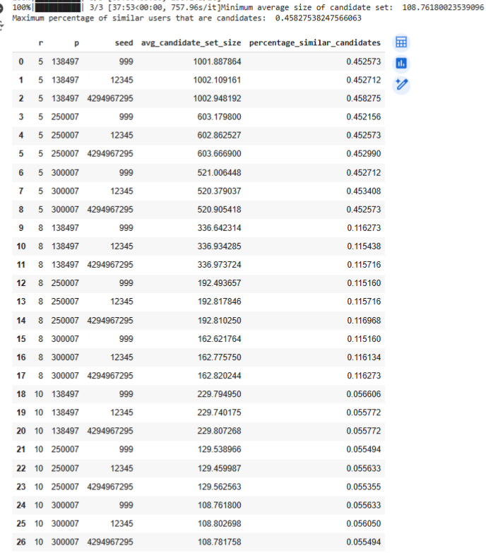
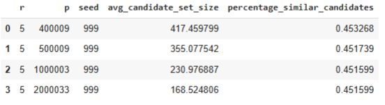
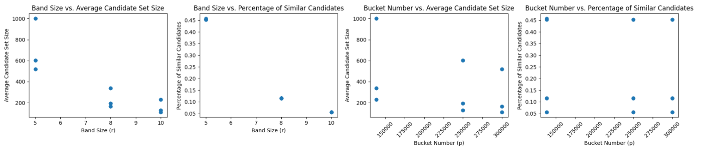
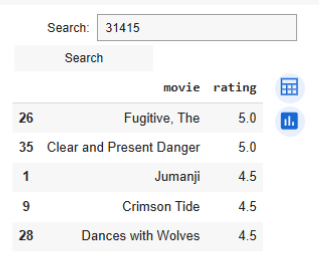

# ADM Homework 4 - Movie Recommendation System, Group #15

This GitHub repository contains the implementation of the fourth homework for the course **Algorithmic Methods of Data Mining** for the Data Science master's degree at Sapienza (2024-2025). The details about the homework are specified here: https://github.com/Sapienza-University-Rome/ADM/tree/master/2024/Homework_4

### Group #15 Team Members
* Sandro Khizanishvili, khizanishvilisandro@gmail.com
* Domenico Azzarito, domazza6902@outlook.it
* Alessandro Querqui, 2031384, querqui.2031384@studenti.uniroma1.it
* Géraldine Valérie Maurer, 1996887, gmaurer08@gmail.com


### Repository Files:
* [main.ipynb](main.ipynb) - Jupyter notebook where you can see solutions and results of Homework 4 in ADM
* [hash.py](hash.py) - Python file containing functions that implement the Minhash and LSH algorithms, along with the hash functions used
* [recommendations.py](recommendations.py) - Python file containing functions that provide movie recommendations for users
* [k_means.py](k_means.py) - Python file that contains custom functions used to implement the K-means algorithm from scratch with the help of the MapReduce technique.
* [k_means_plus_plus.py](k_means_plus_plus.py) - Python file that contains custom functions used to implement the K-means++ algorithm from scratch with the help of the MapReduce technique.

# Project Structure

## Data and Library Importation
* **Dataset Download**: We load the MovieLens dataset from Kaggle, made up of the following files:
    * ```genome_scores.csv```: assigns relevance scores to movie tags
    * ```genome_tags.csv```: assigns unique identifiers to tags
    * ```link.csv```: contains movie identifiers on the imdb and tmdb platforms
    * ```movie.csv```: contains movie title and genre information
    * ```rating.csv```: contains movie ratings information and related timestamps
    * ```tag.csv```: store information about timestamp creation, the user that created them an the movie they were created for
* **Libraries Used**:
    * *zipfile*
    * *pandas*
    * *numpy*
    * *matplotlib.pyplot*
    * *re*
    * *nltk*
    * *collections*
    * *random*
    * *tqdm*
    * *sklearn*
    * *ipywidgets*
    * *IPython.display*
  
## 1. Recommendation System with LSH
* **Steps**:
    - **1.1 Data Preparation**: handling missing values, performing data integrity checks and data type conversions
    - **1.2 Minhash Signatures**: the purpose is to compress user movie watching information based on the sets of movies they have seen. We use custom hash functions from the ```hash.py``` module and randomization to create signature vectors. We experiment with different parameters to create signature vectors that best approximate the jaccard similarity between users' movie sets. We get the best results by setting the length of the signature vectors ```k``` to 150 and the ```seed``` to 4294967295.
    - **1.3 Locality-Sensitive Hashing (LSH)**: the objective of this part of the project is to group potentially similar users into buckets, so that when we need to find similar users, we only compare the target user with the others in the bucket. To achieve this, we use the LSH algorithm to divide signature vectors into ```b``` bands of length ```r``` and hash the bands to buckets. Then, for each user, we memorize their set of candidates - all the users that they share buckets with. We perform a small experiment to see which combinations of band size ```r``` (with ```b = k//r```, ```k=150``` from before), maximum number of buckets ```p``` (large prime) and the ```seed``` for randomness lead to the best results
    - **Movie Recommendation**: this part of the exercise is about recommending movies by using the candidate sets created in the previous part to compare users to other potentially similar users. The functions for this part are contained in the ```recommendations.py``` module. The recommendation system, given a query user, searches for the two most similar users in the query user's candidate set. Then it recommends the five best rated movies by the two most similar users. If there aren't five such movies, it takes the remaining recommendations from the list of best rated movies of the most similar user. We implemented a UI where you can input a query user, but since the widget cannot be displayed in a notebook without running kernel, we displayed a picture of the UI further below.
 
* **Minhash Experiment: Setup and Results**
    - We use two hash functions, ```linear_hash``` and ```bitwise_hash```, to hash movie ID indeces to a range ```[1,p]```, where ```p``` is a fixed prime just slightly larger than the number of movie IDs.
    - We build three scenarios: 1. Only ```linear_hash```, 2. Only ```bitwise_hash```, 3. Both ```linear_hash``` and ```bitwise_hash```. For each scenario, we build signature vectors using the associated hash function structures with random parameters
    - The experiment code iterates over different values of ```k``` (length of signature vectors), different values for the random ```seed```, and tests various random hash function combinations for every scenario
    - **Performance Measure**: as a performance measure for how well certain parameters work, we use the average error rate. With error, we mean the difference between the percentage of equal elements in signature vectors (which is supposed to approximate jaccard similarity) and the real jaccard similarity. Since the number of users is of order $10^6$, computing the similarity between all user pairs is infeasible. Instead, we split the list of users into two random groups of equal size, then compute the similarity between users of the two groups element-wise, for a total number of pairs equal to half the number of users. The best combination of hash functions and parameters is the one that **minimizes** the error.
    - **Results**: the experiments gave us a best performance when using both hash functions: the values ```k=150``` and ```seed=4294967295``` lead to a lowest average error of 0.0158, so about 98.5% accuracy. In the images below are all the results.

**Table with results from all configurations we tried**



**Plot of Average Error Based on the Hash Functions used**


**Table with Parameters and Functions of the Best Configuration we found**


**Resulting Signature Matrix (first 20 rows)**


* **LSH Experiment: Setup and Results**
    - We fix ```k=150``` because we keep the signature matrix from the previous point that gave us the best approximation of the jaccard similarities between users. We experiment with different values of band size ```r``` (with ```b = k//r```, ```k=150``` from before), maximum number of buckets ```p``` (large prime) and the ```seed``` for randomness
    - The module ```hash.py``` contains the LSH and hash functions used in this experiment
    - **Performance Evaluation**: there are two performance measures here. The first one involves the percentage of real similar pairs of users that are hashed into the same buckets - we want to **maximize** this quantity such that the LSH gives us better guarantees of finding similar users already grouped together, and therefore improve quality of movie recommendations. Next, we also consider the average size of candidate sets. This is a quantity we want to **minimize**, because smaller candidate sets imply faster computation when comparing a user with others in the same buckets.  If we use a small band size, the percentage of real similar pairs that are mutual candidates grows, but the candidate set size increases as well (with risk of memory problems), since the condition to become candidates is less strict. Conversely, a larger band size leads to less collisions between users and smaller candidate set sizes. The goal is to find a good trade-off between maximizing the percentage of similar mutual candidates and minimizing the average candidate set size.
    - **Results**: we manage to get good results for both performance measures by taking band size ```r=5```, number of buckets ```p=2000033```, ```seed=999```, which gives us an average candidate set size of about 169, and a percentage of similar mutual candidate pairs of around 45%, which approximately aligns with what theory guarantees us about the threshold jaccard similarity two users must have to have a 50% chance of becoming candidate (approximately because we are working with signature vectors that can contain small errors compared to the real jaccard similarity).

**Tablew with results from all configurations we tried**



**Scatter Plots with Relationships between ```r``` (band size), ```p``` (bucket number), and the Performance Measures**


**Picture of the User Interface of the Recommendation Engine**


## 2. Grouping Movies Together!

## 3. Bonus Question

## Algorithmic Question